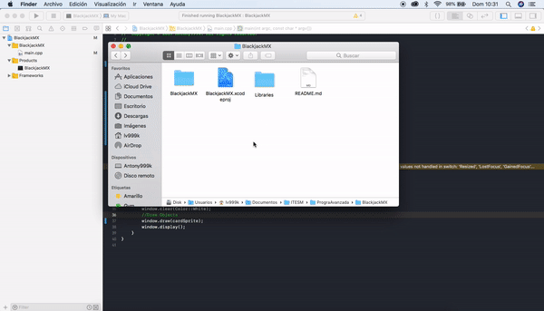

# BlackjackMX
Created by: @antony999k

C++ Blackjack game

# Contribute

## Packages and Libraries
- SFML `v2.5.1`

## Configure Xcode
### Link Resources folder

## Style Guide
### Messages in git commits

- Write the commits and tags in English
- Comenzar el commit con mayúsculas
- Start the commit with upper case
- Consider starting the commit with an emoji
    - :rocket: `:rocket:` when a new version is released
    - :sparkles: `:sparkles:` when new code is added
    - :art: `:art:` improvement in the format / structure of the code
    - :racehorse: `:racehorse:` improvement in code performance
    - :book: `:book:` when writing documentation
    - :bug: `:bug:` when a bug is fixed
    - :fire: `:fire:` when you delete code or files

## Notes

# Changelog

# Help
@antony999k, antony999k@hotmail.com
