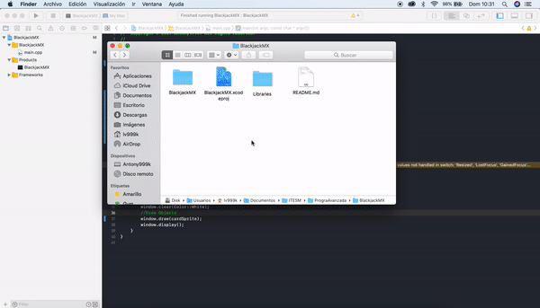
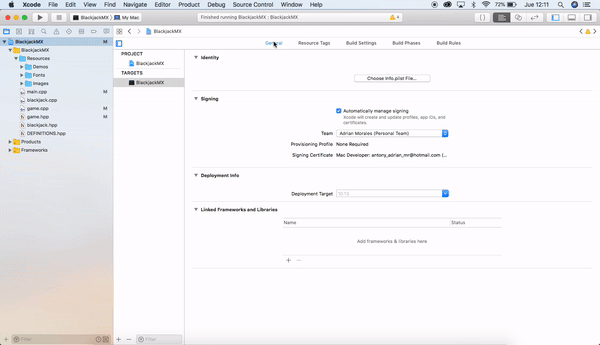

# Contibuting

## Packages and Libraries
- SFML `v2.5.1`

### Install SFML on Mac
`ruby -e "$(curl -fsSL https://raw.githubusercontent.com/Homebrew/install/master/install)" < /dev/null 2> /dev/null`

`brew install sfml`

## Configure Xcode
Correctly configuring xcode ensures that you can execute and make changes to the project
### Link Resources folder
If you can´t find images or sounds when compiling in xcode

### Add libraries

